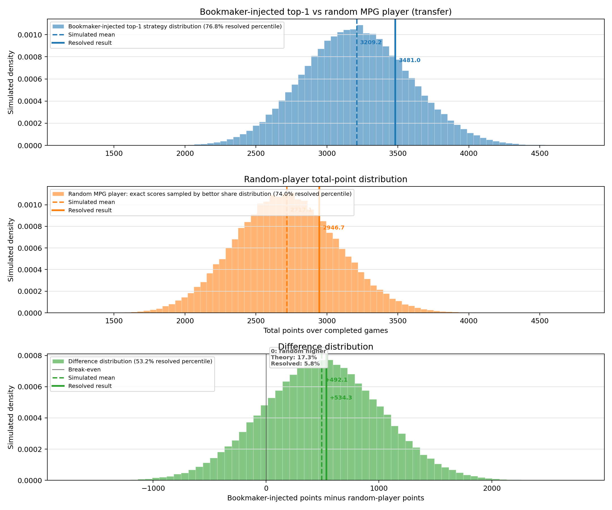

# MPP Edge Lab ⚽

An odds-and-EV toolkit for **MonPetitProno** World Cup prediction contests.

MPP, short for **MonPetitProno**, is the free prediction game launched by MPG
for the 2018 World Cup: players predict match winners and score points through
a system based on odds. This repository turns that simple idea into a small
strategy lab: fetch the market, model scorelines, inject fresh bookmaker
screenshots, and rank the picks that maximize expected MPP points.

Built and vibe-coded by **Manuel Faysse** and **Codex**.

## Why This Exists ✨

MPP rewards correct calls, but the best pick is not always the most likely one.
The edge comes from combining:

- market-implied probabilities
- MPG/MPP point payouts
- exact-score bonus rarity
- bettor popularity
- knockout-game extra-time rules

The repo supports two complementary strategy engines.

## Elimination-Game Odds Conversion ⏱️

Bookmaker markets usually quote 90-minute results, while MPP points for knockout
matches are awarded on the score after 120 minutes, before penalties. Both
strategies therefore convert 90-minute probabilities into 120-minute
probabilities for games tagged `game_stage=elimination`.

The retained draw probability is:

```text
corrected_draw = draw_probability * min(0.90, 3 * draw_probability)
```

The released draw mass is redistributed to home and away in proportion to their
90-minute win probabilities. Exact-score draw mass moves only upward into
extra-time winner scores, for example `1-1` can become `2-1` or `1-2`, never
`1-0`.

## Supported Strategies

### 1. Bookmaker-Injected Strategy 📸

Use this when you have the latest bookmaker **exact-score odds** as screenshots.
The workflow is:

1. Transcribe the bookmaker correct-score odds and bettor percentages.
2. Run `bookmaker_injected_strategy.py`.
3. Log the top-five EV picks into `data/bookmaker_injected/`.
4. Simulate the top-1 strategy against completed matches.

For elimination games, the strategy reports two variants:

- `no_transfer`: bettor shares stay exactly as shown in the screenshot.
- `transfer`: draw bettor shares move to the corresponding +1 extra-time winner
  scores before rarity bonuses are calculated.

Non-elimination games use `no_transfer` rows even inside the `transfer`
simulation.

### 2. `mpg_compute` Strategy 📈

Use this when you want a fully automated pipeline from bookmaker APIs. The
`compute_mpg_strategy.py` flow:

1. Reads bookmaker odds snapshots from The Odds API.
2. Converts 1X2, totals, and spreads into game probabilities.
3. Fits independent Poisson score models for exact-score probabilities.
4. Applies historical score-shape calibration.
5. Combines probabilities with MPP point payouts and bettor-behavior
   multipliers to rank EV picks.

## Bookmaker-Injected Top-1 Bets

Latest logged exact-score screenshot: **Mexico vs Ecuador**, Round of 32.

| Match | Variant | Top-1 bet | Total EV |
|---|---|---:|---:|
| Mexico vs Ecuador | `no_transfer` | Mexico 2-0 | **42.34** |
| Mexico vs Ecuador | `transfer` | Mexico 2-0 | **42.34** |

The current best pick is stable across both variants. The transfer adjustment
mainly changes rarity around draw-adjacent scores, such as `1-0`, without
changing the top pick.

## Latest Bookmaker vs Random-Player Simulation 🧪

Latest full run:

- Completed bookmaker-injected top-1 picks: **79**
- Bookmaker top-1 resolved points: **3481.00**
- Bookmaker logged EV: **3209.79**
- Random-player resolved expected points: **2946.74**
- Realized edge vs random-player baseline: **+534.26**
- Bookmaker top-1 percentile vs sampled random players: **94.25%**



The `transfer` simulation currently matches `no_transfer` on resolved points,
with small logged-EV differences from draw-adjacent rarity transfers in
elimination games.

## Resolved Bookmaker-Injected Bets

Legend: `❌` wrong result, `✅` correct result, `🎯` exact score.

| Result | Match | Best bet | Actual | Base | Bonus | Points |
|---:|---|---:|---:|---:|---:|---:|
| ✅ | Mexico vs South Africa | 1-0 | 2-0 | 49 | 0 | **49** |
| ✅ | Korea vs Czech Republic | 2-0 | 2-1 | 96 | 0 | **96** |
| ❌ | Canada vs Bosnia | 1-0 | 1-1 | 0 | 0 | **0** |
| ✅ | USA vs Paraguay | 2-0 | 4-1 | 74 | 0 | **74** |
| ❌ | Qatar vs Switzerland | 0-1 | 1-1 | 0 | 0 | **0** |
| ❌ | Brazil vs Morocco | 1-0 | 1-1 | 0 | 0 | **0** |
| 🎯 | Haiti vs Scotland | 0-1 | 0-1 | 44 | 50 | **94** |
| ❌ | Australia vs Turkey | 0-1 | 2-0 | 0 | 0 | **0** |
| ✅ | Germany vs Curacao | 3-0 | 7-1 | 15 | 0 | **15** |
| ❌ | Netherlands vs Japan | 1-0 | 2-2 | 0 | 0 | **0** |
| ❌ | Ivory Coast vs Ecuador | 0-1 | 1-0 | 0 | 0 | **0** |
| ✅ | Sweden vs Tunisia | 2-1 | 5-1 | 72 | 0 | **72** |
| ❌ | Spain vs Cabo Verde | 2-0 | 0-0 | 0 | 0 | **0** |
| ❌ | Belgium vs Egypt | 1-0 | 1-1 | 0 | 0 | **0** |
| ❌ | Saudi Arabia vs Uruguay | 0-1 | 1-1 | 0 | 0 | **0** |
| ✅ | Iran vs New Zealand | 1-1 | 2-2 | 116 | 0 | **116** |
| ✅ | France vs Senegal | 1-0 | 3-1 | 46 | 0 | **46** |
| ✅ | Iraq vs Norway | 0-2 | 1-4 | 30 | 0 | **30** |
| ✅ | Argentina vs Algeria | 1-0 | 3-0 | 43 | 0 | **43** |
| ✅ | Austria vs Jordan | 1-0 | 3-1 | 38 | 0 | **38** |
| ❌ | Portugal vs RD Congo | 1-0 | 1-1 | 0 | 0 | **0** |
| ✅ | England vs Croatia | 1-0 | 4-2 | 59 | 0 | **59** |
| 🎯 | Ghana vs Panama | 1-0 | 1-0 | 73 | 20 | **93** |
| ✅ | Uzbekistan vs Colombia | 0-1 | 1-3 | 44 | 0 | **44** |
| ❌ | Czechia vs South Africa | 1-0 | 1-1 | 0 | 0 | **0** |
| ✅ | Switzerland vs Bosnia-Herzegovina | 1-0 | 4-1 | 76 | 0 | **76** |
| ✅ | Canada vs Qatar | 1-0 | 6-0 | 71 | 0 | **71** |
| ❌ | Mexico vs South Korea | 0-0 | 1-0 | 0 | 0 | **0** |
| ✅ | United States vs Australia | 1-0 | 2-0 | 58 | 0 | **58** |
| 🎯 | Scotland vs Morocco | 0-1 | 0-1 | 91 | 50 | **141** |
| ✅ | Brazil vs Haiti | 2-0 | 3-0 | 21 | 0 | **21** |
| ❌ | Turkey vs Paraguay | 1-0 | 0-1 | 0 | 0 | **0** |
| ✅ | Netherlands vs Sweden | 3-0 | 5-1 | 67 | 0 | **67** |
| ❌ | Germany vs Ivory Coast | 0-0 | 2-1 | 0 | 0 | **0** |
| ❌ | Ecuador vs Curacao | 4-0 | 0-0 | 0 | 0 | **0** |
| ✅ | Tunisia vs Japan | 0-1 | 0-4 | 91 | 0 | **91** |
| ✅ | Spain vs Saudi Arabia | 2-0 | 4-0 | 31 | 0 | **31** |
| ❌ | Belgium vs Iran | 1-0 | 0-0 | 0 | 0 | **0** |
| ❌ | Uruguay vs Cabo Verde | 1-0 | 2-2 | 0 | 0 | **0** |
| ✅ | New Zealand vs Egypt | 0-1 | 1-3 | 59 | 0 | **59** |
| ✅ | Argentina vs Austria | 1-0 | 2-0 | 63 | 0 | **63** |
| ✅ | France vs Iraq | 1-0 | 3-0 | 22 | 0 | **22** |
| ❌ | Norway vs Senegal | 0-1 | 3-2 | 0 | 0 | **0** |
| ✅ | Jordan vs Algeria | 0-1 | 1-2 | 67 | 0 | **67** |
| ✅ | Portugal vs Uzbekistan | 1-0 | 5-0 | 24 | 0 | **24** |
| ❌ | England vs Ghana | 1-0 | 0-0 | 0 | 0 | **0** |
| ❌ | Panama vs Croatia | 1-1 | 0-1 | 0 | 0 | **0** |
| 🎯 | Colombia vs DR Congo | 1-0 | 1-0 | 77 | 50 | **127** |
| ✅ | Bosnia vs Qatar | 1-0 | 3-1 | 87 | 0 | **87** |
| ❌ | Switzerland vs Canada | 0-1 | 2-1 | 0 | 0 | **0** |
| ✅ | Morocco vs Haiti | 3-1 | 4-2 | 29 | 0 | **29** |
| ✅ | Scotland vs Brazil | 0-1 | 0-3 | 48 | 0 | **48** |
| ✅ | Czech Republic vs Mexico | 0-2 | 0-3 | 91 | 0 | **91** |
| ❌ | South Africa vs South Korea | 0-1 | 1-0 | 0 | 0 | **0** |
| ✅ | Curacao vs Ivory Coast | 0-4 | 0-2 | 53 | 0 | **53** |
| ✅ | Ecuador vs Germany | 3-2 | 2-1 | 145 | 0 | **145** |
| ❌ | Japan vs Sweden | 1-0 | 1-1 | 0 | 0 | **0** |
| ✅ | Tunisia vs Netherlands | 0-2 | 1-3 | 56 | 0 | **56** |
| ✅ | Paraguay vs Australia | 1-1 | 0-0 | 104 | 0 | **104** |
| ❌ | Turkey vs United States | 0-1 | 3-2 | 0 | 0 | **0** |
| ✅ | Norway vs France | 0-1 | 1-4 | 68 | 0 | **68** |
| ✅ | Senegal vs Iraq | 3-0 | 5-0 | 54 | 0 | **54** |
| ❌ | Cape Verde vs Saudi Arabia | 2-0 | 0-0 | 0 | 0 | **0** |
| 🎯 | Uruguay vs Spain | 0-1 | 0-1 | 57 | 70 | **127** |
| 🎯 | Egypt vs Iran | 1-1 | 1-1 | 114 | 20 | **134** |
| ✅ | New Zealand vs Belgium | 0-3 | 1-5 | 32 | 0 | **32** |
| ❌ | Croatia vs Ghana | 1-1 | 2-1 | 0 | 0 | **0** |
| 🎯 | Panama vs England | 0-2 | 0-2 | 32 | 30 | **62** |
| ❌ | Colombia vs Portugal | 2-1 | 0-0 | 0 | 0 | **0** |
| ✅ | DR Congo vs Uzbekistan | 2-1 | 3-1 | 63 | 0 | **63** |
| ✅ | Algeria vs Austria | 1-1 | 3-3 | 103 | 0 | **103** |
| ✅ | Jordan vs Argentina | 0-1 | 1-3 | 32 | 0 | **32** |
| 🎯 | South Africa vs Canada | 0-1 | 0-1 | 64 | 50 | **114** |
| ✅ | Brazil vs Japan | 1-0 | 2-1 | 65 | 0 | **65** |
| ❌ | Germany vs Paraguay | 1-0 | 1-1 | 0 | 0 | **0** |
| ❌ | Netherlands vs Morocco | 1-0 | 1-1 | 0 | 0 | **0** |
| ✅ | Ivory Coast vs Norway | 0-1 | 1-2 | 75 | 0 | **75** |
| ✅ | France vs Sweden | 1-0 | 3-0 | 38 | 0 | **38** |
| 🎯 | Mexico vs Ecuador | 2-0 | 2-0 | 84 | 30 | **114** |
|  | **Total** |  |  | **3111** | **370** | **3481** |

## Quick Start

Install dependencies:

```bash
python3 -m pip install requests
```

Fetch the latest odds snapshot:

```bash
python3 fetch_odds.py --skip-discovery
```

Compute the API/model-driven MPP strategy:

```bash
python3 compute_mpg_strategy.py
```

Run the bookmaker-injected simulation:

```bash
python3 simulate_bookmaker_injected.py --include-random-player
```

Main outputs:

- `data/odds_snapshots/latest.csv`
- `data/processed/latest_game_probabilities.csv`
- `data/processed/latest_exact_score_probabilities.csv`
- `data/processed/latest_exact_score_probabilities_calibrated.csv`
- `data/mpg/mpg_optimal_strategy.csv`
- `data/bookmaker_injected/expected_mpg_top5.csv`
- `data/analysis/strategy_simulations/bookmaker_injected/top1_vs_random_player_distribution_transfer.png`

## Main Scripts

- `fetch_odds.py`: downloads raw bookmaker odds and writes timestamped snapshots.
- `compute_mpg_strategy.py`: computes the API/model-driven MPP strategy.
- `bookmaker_injected_strategy.py`: ranks exact-score screenshots and logs
  bookmaker-injected picks.
- `simulate_bookmaker_injected.py`: simulates bookmaker-injected top-1 picks
  against completed games and compares them to a bettor-share random baseline.
- `fetch_completed_games.py`: fetches final scores and updates
  `data/mpg/completed_games.csv`.

Most day-to-day work should use those root scripts. Deeper files under
`odds_pipeline/` and `data/analysis/` are implementation helpers or historical
analysis utilities.

## Documentation

- [Pipeline Overview](docs/pipeline_overview.md)
- [Fetching Odds](docs/fetch_odds.md)
- [Fetching Completed Games](docs/fetch_completed_games.md)
- [Data Layout](docs/data_layout.md)
- [Consistency Checks](docs/consistency_checks.md)
- [MPG Strategy and Scoring Model](docs/mpg_strategy.md)
- [Bookmaker-Injected MPG Strategy](docs/bookmaker_injected_mpg_strategy.md)
- [Requested Strategy Analysis](docs/requested_strategy_analysis.md)

## Notes

Round of 32 fixtures fetched between `2026-06-28T00:00:00Z` and
`2026-07-04T00:00:00Z` are tagged as `game_stage=elimination`. For these games,
90-minute market probabilities are converted to 120-minute MPP probabilities
before EV ranking.

The Odds API key is read from `ODDS_API_KEY` or a local `.odds_api_key` file.

## Sources

- [Mon petit gazon on Wikipedia](https://fr.wikipedia.org/wiki/Mon_petit_gazon)
  for background on MPG and the launch of MonPetitProno.
